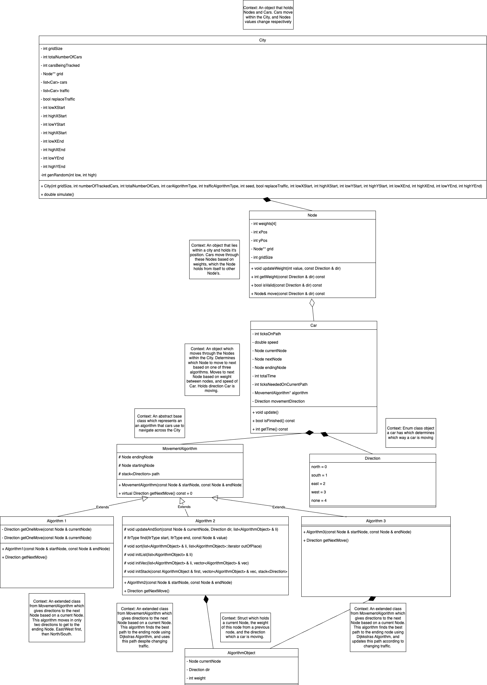

# Documentation for Final_Project_Spider_Plant
Noah Dunham and Alex Leonida  

## Table of Contents
* [Intended Use](#intended-use)
* [Design](#design)
* [OutputFiles](#output-files)
* [Assumptions](#assumptions)
* [Results](#results)
* [User Manual](#user-manual)
* [Works Cited](#works-cited)

## Intended Use
This program is meant to simulate cars moving within a city. By populating a city with moving cars, we are then able to determine the both the fastest routes for each car, and the average time it takes for each car to get to their destination. By using different algorithms, where some determine a route based on traffic, we ask ourselves the important question, "How much does knowledge about traffic affect driving time?"

_NOTE_ that collisions do not exist in this simulation.
_NOTE_ that creating a 1 x 1 City grid will break this simulation. With this being said, there should never be a reasonable need to create a gridSize 1 City. This defeats the purpose of what this application aims to achieve. 

While the cars move, traffic between roads dynamically change in real time. Allowing the static change between different number of cars, the size of the grid, and the randomness of how far away each car's destination is, lets us vary the simulation in a multitude of ways within our control. By allowing the static, dynamic, and ['pseudo random'](#works-cited) change of the simulation occur, we maximize what it means for something to be truly defined as a simulation. 

_NOTE_ that the word 'traffic' is used interchangeably throughout this document. There are two use cases, one is the direct association of what it means to account for excess travel time as shown in [Intended Use](#intended-use), and the other is referred to as specific Cars inside of the City who aren't being tracked, ase seen in [City Class](#city-class). The major difference is that the former eludes to _all_ cars, while the latter refers to only some cars (if any). 

## Design
### UML Diagram

### The Classes!

#### City Class
The City class represents a square 'city' in which cars move across roads/paths to get to a destination. This is where the user will be able to interact with the application. The City object has the ability to populate the city, and to run a simulation on itself. Upon creation of this object, the City must know how many of Cars are being tracked, how many Cars are not being tracked, how large the city is, how the tracked cars (cars not being tracked) are moving based on 1 of 3 algorithms, how the traffic cars are moving based on 1 of 3 algorithms, whether or not traffic cars are being replaced or not, and general locations of where the cars are allowed to start and end at. The position (0,0) in the City lies on the top left of the square shaped grid. **Note** that there will always be a positive weight between paths in a City. 

#### Node Class
The Node class represents the blocks within a City. Each Node holds the weights of each path to it's neighboring Nodes (A weight is how long it will take to get to the next Node if the car's speed is 1). A path weight to and from two Nodes _must_ be the same at all times. A Node also holds it's X and Y position within the city. It is important to note that the Node object also has access to the entire Node** grid which is passed in by reference within the constructor. Accessing this grid at any given point at indices grid[xPos][yPos] respectively should return itself. 

#### Car Class
The Car class represents a car driving through the city by hopping between Nodes. The Car will have a starting Node and a ending Node. It will drive through the city until it reaches the ending Node based on where it's designated algorithm tells it to go. There are two types of cars in this city, the ones that are kept track of, and the ones that are not. We allow the user to determine these two numbers, and to determine how they will move based on 1 of 3 algorithms. It is possible to keep track of all of the cars within the city! Each car that is kept track of moves according to one of three algorithms; there is the smart algorithm (3), the not so smart algorithm (2), and the naive algorithm (1). All cars not being kept track of are considered part of the 'traffic' group. Cars of traffic still have to start somewhere and end somewhere. 

#### Direction Enum Class
The Direction class allows for the tracking of the movement of a car. A car always has a direction, and by keeping track of where the car is moving, we can track where the car is headed next, and where the car came from, instead of having to keep other Nods as attributes. This saves memory and time upon the creation of a new object.

#### Movement Algorithm Class
The MovementAlgorithm Class is abstract base class which represents an algorithm assigned to a Car used to navigate through the City given a current position and ending position. In the case of this project, there are three classes that extend this class, Algorithm Classes 1, 2, and 3. The Movement Algorithm class holds a stack of Directions for the Car which tells the Car which directions to move from its starting Node to its ending Node. By popping off the top of this stack, we can get the car’s next move. This stack is determined by one of the three algorithms. It is _highly not_ recommended to create and pass in an outside algorithm into this project.

#### Algorithm Object Struct
The Algorithm Object struct is used for our Algorithm 2 and Algorithm 3 classes. It is important to keep track of what the lowest weight to get to a Node is, and from what Direction it came from. By keeping track of what Direction it came from, we are able to keep track of what the previous Node is (the Node that was used to get to the current Node). This is explained in detail in [Algorithm 2 Class](#algorithm-2-class)

#### Algorithm 1 Class
This class extends the MovementAlgorithm Class. This algorithm does not account for traffic in any way. This class's main purpose is to use the getNextMove() method which returns a Direction for the Car to move to next. The algorithm from this class moves the Car in the east / west direction first until it is aligned with the ending position. It then moves north / south to the ending position. Because both the X position and the Y position are matching (because the ending position does not change), the Car reaches its destination. 

#### Algorithm 2 Class
This class extends the MovementAlgorithm Class. This algorithm accounts for traffic at the very beginning of it's creation, finds the most optimal path between a starting and ending Node, keeps this path stored, and uses it. This class's main purpose is to use the getNextMove() method which returns a Direction for the Car to move to next. The algorithm from this class uses an implementation of Dijkstras algorithm. Each weight (the distance to get to the next Node) except for the starting Node's distance is set to 'infinity'. The starting Node's distance from itself is 0. Each time a Node is checked, the weight from the path it just took to reach it is checked against it's most previous lowest weight to get there. We check this by using the Algorithm Object which holds a current Node, a Direction (so we know which Node it previously came from), and a weight (so we can check how long it took to get there). The first time we reach a new Node, or in this case Algorithm Object, the weight will be set to however long it took to get there, because the default value was set to be infinity. Nothing is no real number larger than infinity! By traversing through the grid in a breadth first search manner, we eventually reach the ending Node, and trace the most optimal path taken through the grid by using the Direction attributes in the Algorithm Object. Each time we take this path, and push each element to our stack of Directions in the [Movement Algorithm Class](#movement-algorithm-class)

#### Algorithm 3 Class
This class extends the MovementAlgorithm Class. This algorithm accounts for changing traffic throughout the simulation. By accounting for changing traffic every time the algorithm is prompted for a new next move, this algorithm should theoretically be better than algorithm 1, and possibly 2 in most cases. This class's main purpose is to use the getNextMove() method which returns a Direction for the Car to move to next. This algorithm makes use of the [Algorithm 2 Class](#algorithm-2-class) by calling it over and over again, and creating a new algorithm 2 object every time with a different starting Node. Getting a new move from the algorithm 3 class, which uses the algorithm 2 class's getNextMove() method, allows for the accounting of changing traffic

**NOTE** that although there is a theoretical 'best' algorithm for this simulation, this will *NOT* always be the case. For example, if cars all started one spot away from its ending position, and were kept far away from each other, the computation time for the first algorithm would b

### Speed Formula
The way of assigning the ticks needed on a current path for a Car to move to the next node is a critcal peice of the program. The formula is in the code as:
```cpp
ticksNeededOnCurrentPath = int(currentNode.getWeight(movementDirection)/speed);
```
Lets break this down. First, here are the meanings behind each term:
* ticksNeededOnCurrentPath: The number of computer ticks it takes for the car to move to the next Node from the Node it is currently on.
* currentNode: The Node that the Car is currently on.
* getWeight(): A Node method which returns the number of ticks it takes for the Car to get to the next Node if it's speed was 1. 
* movementDirection: The Direction object showing which direction the Car is moving. 
* speed: The speed of the car held in a double. Can range from (0, 1]
  
By finding the current ticks that we need to wait on the path before we can reach the next Node, we need to know how much we would need to wait between Nodes if our Car's speed was at it's maximum speed, 1.0. If our Car's speed was at a maximum 1.0, and the weight from Node1 to Node2 was 4, it would take 4 ticks for the Car to get from one Node to another. We know this because for each tick, the Car will 'move one space further' on the path between Nodes. In other words, 4/1 = 4. If our Car's speed was 0.5, half of its original speed, and the weight to the next Node was 4 again, it would take 8 ticks, where after each tick the Car would move half the distance it did from our previous example. 4/0.5 = 8. By using this formula we are able to determine how long it will take for a Car to get from one Node to another. 

However, this means that Nodes with a weight of 1 between them will allow Cars of speed 1 to immediately jump from one Node to another. However, conditionals are created so that the weights between two Nodes can never be less than 1. 


### Changing / Replicating Traffic
Traffic (cars not being tracked) within this simulation poses an interesting concept. While it is normal for other cars to drive in different ways (in this case, the traffic), this simulation does not allow this sort of behavior. Traffic will be assigned one, and only one Movement Algorithm. In a simulation where tracked Cars continue to make it to their destination without traffic replacement, less and less Cars will crowd the City over time, leading to faster travel times for Car's being tracked solely due to less Cars being on the road in total. Because of this, the simulation allows for the replicating of traffic. If this option is allowed upon the creation time of the City, every time a Car is removed from the City's road, a traffic Car replaces the car that was removed. 

The following code shows us a critical piece of our program which updates the traffic within roads. 

```cpp
//Car.cpp line 30
currentNode->updateWeight(1, movementDirection);
```

This updateWeight() updates the weights of the paths around a Car. In the instance above, a car has entered a new path, and is now moving towards a new Node (This means that the car has just reached it's previous Node, or is just entering a path at the start of the simulation). The Car is on a Node, and while it moves towards a certain direction, it updates the weight of the path it's traveling on by 1 (it's adding itself). Now, we know that there is 1 more Car located on the path between these two Nodes, and it will take longer for other Cars to traverse between these two Nodes. 
 
Likewise, a car leaving a path looks like this
```cpp
//Car.cpp line 47
currentNode->updateWeight(-1, movementDirection);
```

### Starting & Ending Points 
For reference, a Car constructor looks like this 
```cpp
Car(Node* & startNode, Node* & endNode, double speed, int algorithmType);
```
Line 35 City.cpp shows an example of the implementation of being able to start at and end a specific location on the grid. In the below piece of code, a car object is being created, and being added to a list.
```cpp
cars.push_back(Car(grid[genRandom(lowYStart, highYStart)][genRandom(lowXStart, highXStart)], grid[genRandom(lowYEnd, highYEnd)][genRandom(lowXEnd, highXEnd)], (((double)genRandom(0,5))*0.1) + 0.5  , carAlgorithmType));
```
The grid variable is a double array which holds our City of Nodes, and therefore by accessing a specific place in this array, we are accessing a Node. The genRandom() method returns a random value between the high and low parameters passed in. 

By allowing for different starting and ending points, we are more accurately able to simulate something that will happen in real life. For example, an event or gathering may cause people to want to end up in the same general location. Even futher, this could be used in simulation for people being repelled from one location of the City, to attracted to another. If there was a fire on one location of the city, which looked like this
```markdown
_________________________________________________
|       |       |       |       |CURRENT|       |
|       |       |       |       |  END  |       |
_________________________________________________
|       |       |       |       |       |       |
|       |       |       |       |       |       |
_________________________________________________
|       |       |       |       |       |       |
|       |       |       |       |       |       |
_________________________________________________
|       |       |       |       | FIRES | FIRES |
|       |       |       |       | HERE! | HERE! |
_________________________________________________
|       |       |       |       | FIRES | FIRES |
|       |       |       |       | HERE! | HERE! |
_________________________________________________
|       |       |       |       |       |       |
|       |       |       |       |       |       |
_________________________________________________
|       |       |       |       |CURRENT|       |
|       |       |       |       | START |       |
_________________________________________________
|       |       |       |       |       |       |
|       |       |       |       |       |       |
_________________________________________________
```
which caused the cars moving in this direction to move to another route, 
we could set the starting locations here, ending locations here, and simulate a City grid here!
```markdown
_________________________________________________
|       |       |       |       |       |       |
|       |       |       |       |       |       |
_________________________________________________
|       |       |       |       |       |       |
|       |       |       |       |       |       |
*********************************________________
*       *       *       *CURRENT*       |       |
*       *       *       *  END  *       |       |
*********************************________________
*       *       *       *       * FIRES | FIRES |
*       *       *       *       * HERE! | HERE! |
*********************************________________
*       *       *       *       * FIRES | FIRES |
*       *       *       *       * HERE! | HERE! |
*********************************________________
*       *       *       *CURRENT*       |       |
*       *       *       * START *       |       |
*********************************________________
|       |       |       |       |       |       |
|       |       |       |       |       |       |
_________________________________________________
|       |       |       |       |       |       |
|       |       |       |       |       |       |
_________________________________________________
```

Furthermore, by adding in sections to this city where no people reside, we can calculate whether it's worth it to take another route based on the knoweledge of traffic within the City. For example, if these are the _main_ roads, where most people travel within a City,

```markdown
_________________________________________________
|       |  END  |       |       |       |       |
|       | POINT |       |       |       |       |
_________________________________________________
|       |       |       |       |       |       |
|       |       |       |       |       |       |
*********************************________________
* MAIN  * MAIN  * MAIN  * MAIN  *       |       |
* ROADS * ROADS * ROADS * ROADS *       |       |
*********************************________________
* MAIN  * MAIN  * MAIN  * MAIN  *       |       |
* ROADS * ROADS * ROADS * ROADS *       |       |
*********************************________________
* MAIN  * MAIN  * MAIN  * MAIN  *       |       |
* ROADS * ROADS * ROADS * ROADS *       |       |
*********************************________________
* MAIN  * MAIN  * MAIN  * MAIN  *       |       |
* ROADS * ROADS * ROADS * ROADS *       |       |
*********************************________________
|       |  CAR  |       |       |       |       |
|       | HERE  |       |       |       |       |
_________________________________________________
|       |       |       |       |       |       |
|       |       |       |       |       |       |
_________________________________________________
```

This application will allow us to determine whether it would be faster to
1. Move through the main roads without regard for traffic
2. Move through the main roads with with knowledge of traffic
3. Take the outside route where, while it would take longer to get there, might be advantageous in the long run

Something like option #3 would look like this 

```markdown
/*
_________________________________________________
|       |  END  |       |       |       |       |
|       | POINT |  <--  |  <--  |  <--  |       |
_________________________________________________
|       |       |       |       |   ^   |       |
|       |       |       |       |   |   |       |
*********************************________________
* MAIN  * MAIN  * MAIN  * MAIN  *   ^   |       |
* ROADS * ROADS * ROADS * ROADS *   |   |       |
*********************************________________
* MAIN  * MAIN  * MAIN  * MAIN  *   ^   |       |
* ROADS * ROADS * ROADS * ROADS *   |   |       |
*********************************________________
* MAIN  * MAIN  * MAIN  * MAIN  *   ^   |       |
* ROADS * ROADS * ROADS * ROADS *   |   |       |
*********************************________________
* MAIN  * MAIN  * MAIN  * MAIN  *   ^   |       |
* ROADS * ROADS * ROADS * ROADS *   |   |       |
*********************************________________
|       |  CAR  |       |       |   ^   |       |
|       | HERE  |  -->  |  -->  |   |   |       |
_________________________________________________
|       |       |       |       |       |       |
|       |       |       |       |       |       |
_________________________________________________
```
Where while the path may look longer, the Car's algorithm has correctly deduced that taking this path will be shorter, as opposed to going through the main roads where traffic may be higher. 

By problem solving in this way, truly meaningful, implementations of this application can be discovered. 

## Output Files
See [Results.md](#results) for more information
### Naming Conventions
All output files lie within [../OutputFiles](../OutputFiles)
There are four parts to the naming of an output file

In this list, each item represnet a broad description of the paraemter to an output file name
The first indented items are the options of names for output files
The second indented items explain the first indented item choices
1. Size of the grid
    * 3x3
        * These represent arbitrary integers, they can be other integers, as long as integer I is the same as integer I when choosing this name. Ex. 52x52
    * 5x5
    * 10x10
    * 15x15
    * 20x20
2. Whether traffic is being replaced or not
    * Replace
        * traffic is replaced
    * noReplace
        * traffic is not being replaced in the simulation 
        * we have no output files like this because it did not yield interesting results, but it is possible
3. How many traffic cars there are compared to tracked cars
    * Notraffic
        * All car are being tracked in this simulation
    * 100%traffic
        * For every one car that is being tracked, there is another car not being tracked
    * 200%traffic
        * For every one car that is being tracked, there are two other cars being tracked
    * ...
        * Represents all numbers from 300%-400%
    * 500%traffic
        * (Can add 'Alg1', 'Alg2', or 'Alg3' to this parameter)
        * For every one car that is being tracked, there are five other cars being tracked
4. Different starting / ending points
    * Random 
        * The cars start and end in different locations 
    * Ring
        * Starting and ending locations are in the middle of the city, but the entire City surrounds the starting and ending locations 
        * Algorithm 1 Cars will stay within the center of the City, while Algorithm 2 and 3 Cars will probably move to the outside of the City where there is no traffic
        * For reference, this is mentioned on slide 62 of our [presentation](./presentation.txt)
    * Rush Hour 
        * Starting and ending locations lie on different sides of the map
        * When the simulation starts, all Cars move from one side of the City to the other side
        * For reference, this is mentioned on slide 20 of our [presentation](./presentation.txt)

An example of the name of an output file would look like this 
```md
3x3_Replace_100%traffic_Random.csv

or with the added parameter

10x10_Replace_100%trafficAlg3_Random.csv
```
### What We Did
When creating output files, our group decided to change the size of the grid. We used sizes 3,5,10,15,20.
We used sizes 15 and 20 only for what we thought were interesting instances of the simulation, because with larger grid sizes, run times were longer as well. 

Our output files always replenished traffic in these simulations. We did this in order to gain more interesting results. By not replenishing traffic, the total number of Cars in the city will decrease, simply leading to faster Car arrival to destination times as ticks of time go by.

We also decided to used 100%traffic, 500%traffic, and Notraffic to tracked Car ratio because multiplying the City size by 5 is enough to cause significant change within our output data, if there were any. We occasionally used the Alg3 parameter in order to test if ‘smarter’ traffic would affect our simulation of tracked Car data in an interesting way. 

We also tested all of the different starting / ending location parameter options. 

### Data 
The title of what was simulated lies on at the top of the file
The headers for each column lies right below the title on the second line 
The numbers on the first column describe the number of Cars being tracked. This was hard coded in by us, on line 47 of [main.cpp](../source/main.cpp). 
The numbers on the second, third, and fourth lines show what a City object's simulate() method would return. The average ticks it takes for each Car to get from its starting to its ending point. 

### Analysis of Data
See [Results.md](#results)

### How to Do it Yourself
[UserGuide.md](#user-manual)


## Assumptions
### Technical Assumptions
* The user follows the [Use/ending Guide](./UserGuide
We occasionally used 100trafficAlg3 in order to determine whether or not a 'smarter' algorithm of traffic would change the output of our data. 
.md) when running the program.
* Because the user follows the [UserGuide](./UserGuide.md), the user is able to appropriately input parameters into the construction of a City object. 
* The user is technically competent - can build, run, interact with the terminal
* The user does not change the files, file names, nor the location of prexisting files.
* The user's file paths are correct upon running this program
* The user does not have 0 tracked cars, with a positive integer of total cars, inside of a City that replaces traffic
* The user doesn't create a city where there is only one possible starting node and only one possible ending node and these nodes are the same
* The user doesn't create a city with 0 possible starting nodes and 0 possible ending nodes
### Design Assumptions
* There are no collisions
* The time it takes to travel down a road is porpotional to the number of cars on that road
* Cars can pass each other instantly if one is faster than the other
* Cities are squares with exclusively 4-way intersections
* Cars update in waves and compute paths in waves
    - Not all cars update at the same time. While each car updates once per tick, one car has to be the first to update and one must be the last
    - If two cars attempt to enter an road on the same tick, one will enter first when tehre are x cars on the road, and one will enter behind with x+1 cars on the road. This is somewhat accurate to real life where cars are arranged in a queue structure upon entering a road

## Results
See [Results.md](./Results.md)

## User Manual
See [UserGuide.md](./UserGuide.md)

## Works Cited
* Referenced https://www.cs.cmu.edu/~15110-f19/slides/week13-2-simulation-events.pdf for what it means to have a 'good simulation'.
* Referenced https://www.youtube.com/watch?v=GazC3A4OQTE for Dijkstras path finding algorithm
* Referenced https://en.cppreference.com/w/cpp/types/climits for max values in C, where we used INT_MAX in Algorithm 2
* Referenced https://en.cppreference.com/w/cpp/container/list for general function headers and return values
* Referenced https://en.cppreference.com/w/cpp/language/enum for enum definiton (Direction)
* Referenced https://en.cppreference.com/w/cpp/language/dynamic_cast for car copy constructor
* Referenced https://en.cppreference.com/w/cpp/language/typeid for car copy constructor
