# Results
We ran the simulation with various intitial conditions to determine interesting information about the speed at which cars move though the city.  
  
* All simulations used a random number to seed the values, and all the different algorithm types with the same values (a vertical column in the graph) used the same seed, meaning all the cars start and end in the same location.  
* All simulations replaced traffic and cars once they reached their destination to keep the number of cars on the road constant.  
* Unless otherwise specified, all traffic cars use algorithm 1 to navigate.  
* All graphs presented have a y-axis of the average number of ticks taken for a car to reach its destination.
* If the number of tracked cars is small (close to the y axis), the random starting location of a car has a large impact on the overall value, as there is nothing to average it against. This is interesting data and we chose to include it, but it should not be considered when analyzing the primary use cases of the algorithms, a large city.

## No traffic, random start/end locations
* Cars have random start and end points anywhere in the city.  
* There is no initial traffic other than the tracked cars, so tracked cars = total number of cars.  
### Grid Size = 3
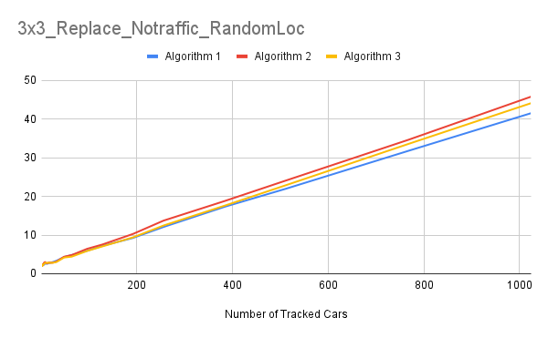

### Grid Size = 5
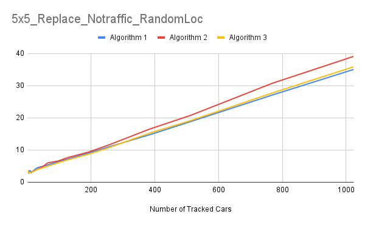

### Grid Size = 10
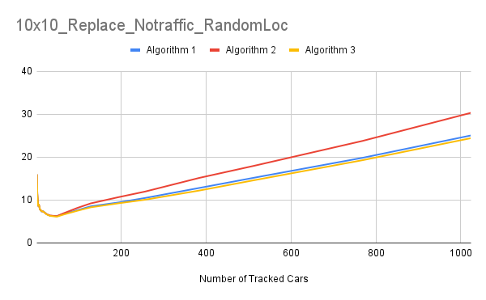

### Grid Size = 15
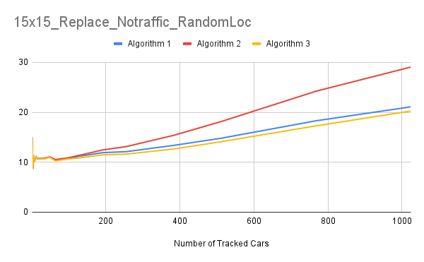

### Grid Size = 20

### Analysis
We see that regardless of the grid size, all algorithms scale lineraly relative to the number of cars. Additionally, algorithinm 2 performs slightly worse in all grid sizes. Algorithms 1 and 3 are similar enough to not have a meaningful impact on travel times. In practice, given these conditions, algorithm 1 is the best choice because it is tied for the best output and requires significantly less computation. For fewer than 75 cars, all three algorithms perform essentially the same, and again algorithm 1 is the best choice because of its lower computation time. We think that algorithm 1 performs so well is because given random pathing and random start locations, you will encounter similar amounts of traffic no matter which way you go, so the shortest physical distance is almost always clode to if not the best path

## 100% traffic, random start/end locations
* Cars have random start and end points anywhere in the city.  
* There is initially traffic, and the number of traffic cars  = number of tracked cars. This means 2 * tracked cars = total number of cars.  
### Grid Size = 3
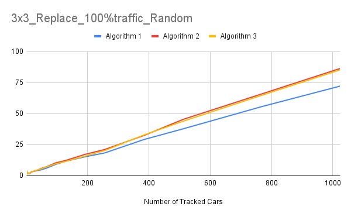

### Grid Size = 5
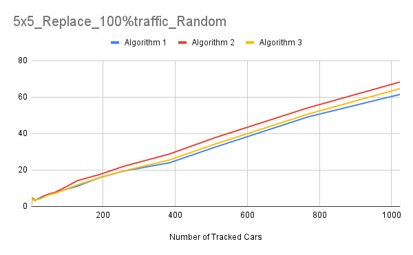

### Grid Size = 10
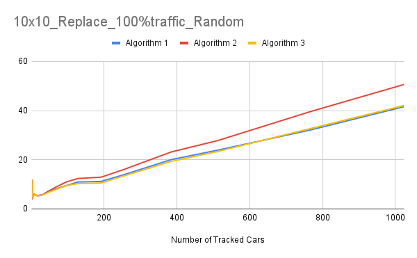

### Analysis
Again, all algorithms scale lineraly relative to the number of cars and all algorithms perform about the same for fewer than 75 cars. Algorithm 1 performs the best regardless of grid size, but algorithm 3 improves relative to the other algorithms as the grid size gets larger. Algorithm 1 performs better for the same reasons as above, but algorithm 2 is interesting. As the traffic reaches the end, new cars are created on the city, potentially where the car is going to go. Algorithms 1 and 2 can't react to this, but algorithm 3 can. With a larger city, there is more room for algorithm 3 to react to new cars and change it's route, leading to the improved timings relative to the other algorithms

## 500% traffic, random start/end locations
* Cars have random start and end points anywhere in the city.  
* There is initially traffic, and there are 5 traffic cars for every tracked car. This means 6 * tracked cars = total number of cars.  
### Grid Size = 3
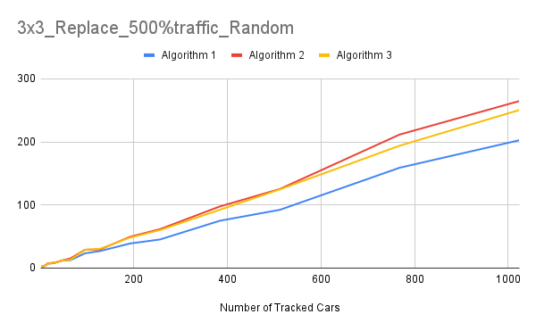

### Grid Size = 5
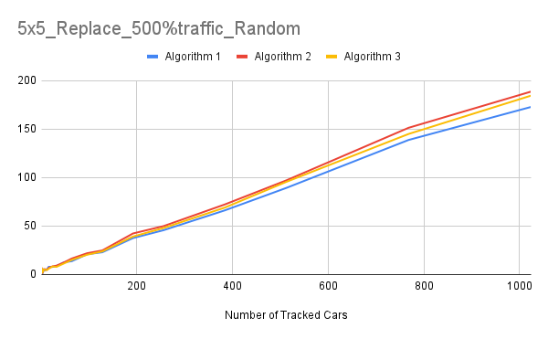

### Grid Size = 10
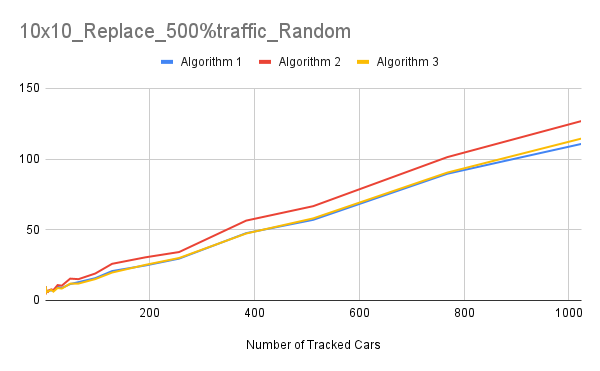

### Analysis
The patterns and conclusion are identical to the 100% traffic case. The only difference is all the algorithms take significatly longer to complete simply because there are more cars.

## 100% traffic, random start/end locations, traffic uses algorithm 3
* Cars have random start and end points anywhere in the city.  
* There is initially traffic, and there is 1 traffic car for every tracked car. This means 2 * tracked cars = total number of cars.  
* All traffic cars use algorithm 3 for navigation
### Grid Size = 3
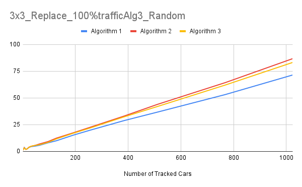

### Grid Size = 5
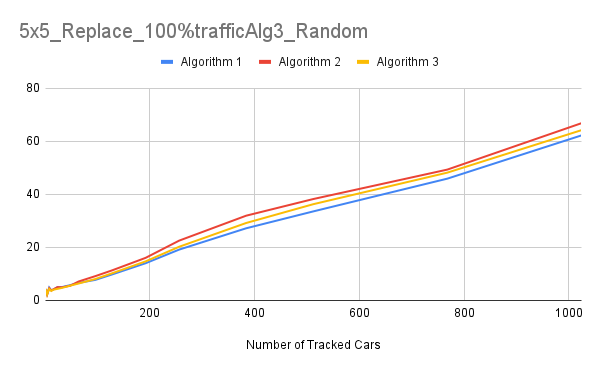

### Grid Size = 10
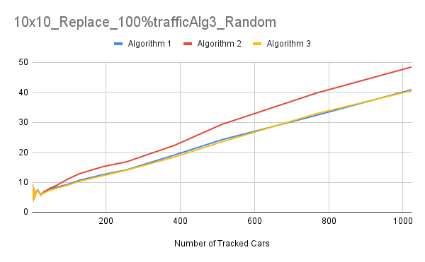

### Analysis
The patterns and conclusion are identical to the 100% traffic case. THe amount of time for the cars tracked cars to finish is basically the same for large numbers of cars. 

## No traffic, ring
* Cars have random start and end points anywhere in the city. However, there is a ring of intersections around the outside of the city cars can use to travel.
    * This does not affect algorithm 1, whose physically shortest path will never take it into the outside ring
    * A 5x5 city really is a 7x7 city with no start or end points in the outer intersections
* There is initially no traffic
### Grid Size = 3
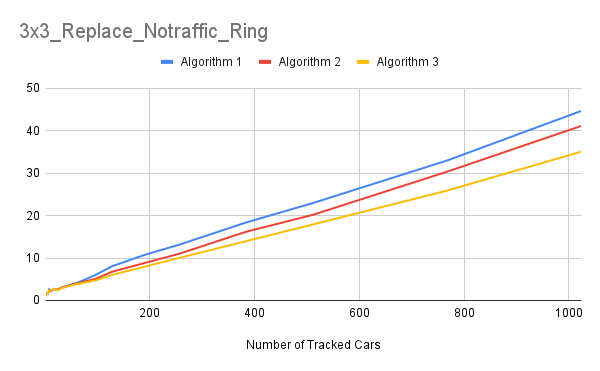

### Grid Size = 5
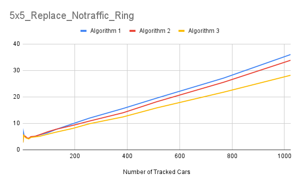

### Grid Size = 10
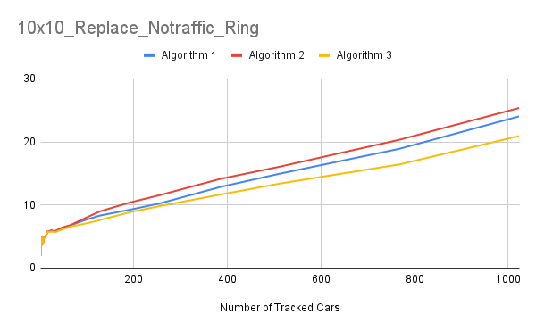

### Analysis
As usual, all algorithms scale lineraly relative to the number of cars and all algorithms perform about the same for fewer than 75 cars. However, algorithm 1 is performing far worse relative to the other algorithms. This is obviously because it does not have access to the outer ring. However, cars are punished by at least two ticks for travling on the outer ring, and in algorithm 2, it is possible all cars could end up on the outer ring and get terrible times. However, algorithm 3s ability to move off the ring if it is crowded makes it incredibly good. In every simulation we have looked at thus far, the amount of time for cars to finish goes down as grid size inceases because collisions with cars slow cars down more than distance. This makes a lot of sense because increasing gridsize by a faactor of n increases the physical distance required by a factor of n, but decreases the density of the cars by a factor of n^2. Esentially, algorithms 2 and 3 are getting access to a a larger gridsize for a very small penalty. This explains why algorithm 1 is worse. However, this is a very real senario. I will never drive down division if I can avoid it, I will always take slightly longer backroads but get to my destination faster.

## No traffic, rushhour
* Cars randomly start on the right column of the city and randomly end on the left side of the city.
    * All the cars need to move to the right, but some will need to go up and som will need to go down to reach the destination.
    * This is meant to simulate rush hour traffic when everyone wants to leave a city.
* There is initially no traffic
    * Any traffic added by cars finishing is most likely irrelavent because they will be generated behind all the other cars who have already started moving. This means they will almost certainly not be able to catch up to the tracked cars.

### Grid Size = 3
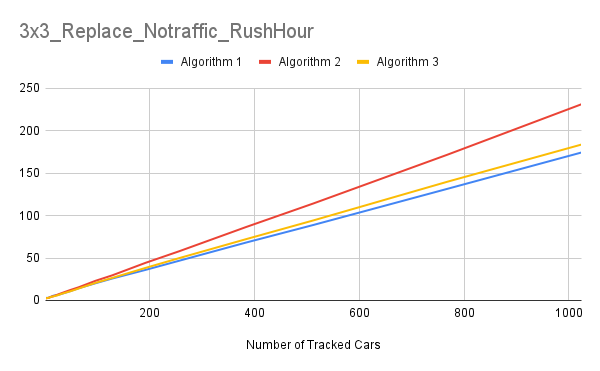

### Grid Size = 5
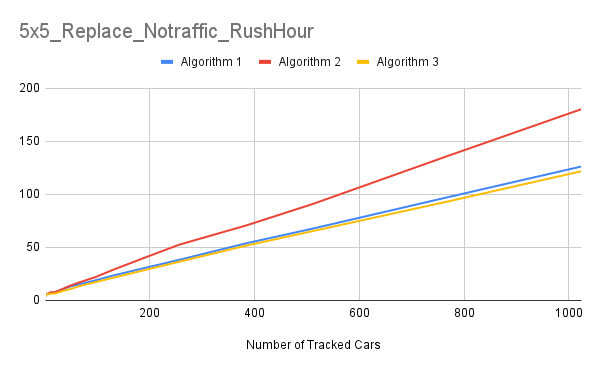

### Grid Size = 10
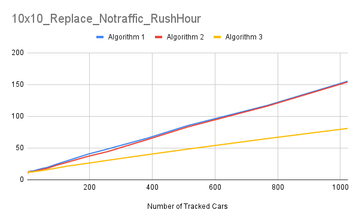

### Grid Size = 15
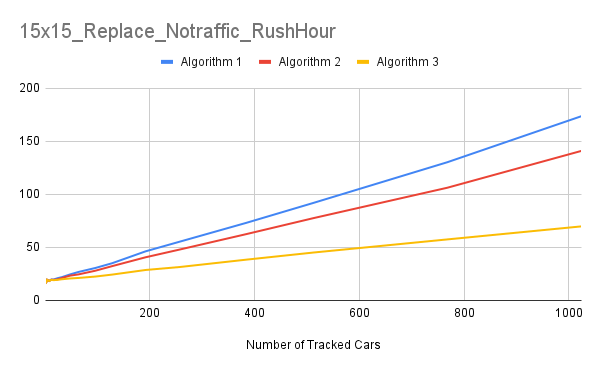

### Grid Size = 20
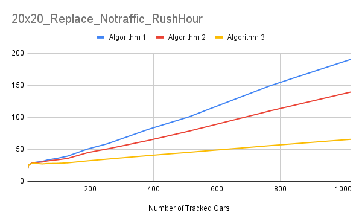

### Analysis
For small gridsizes, the performanc of the algorithms looks the same as with random generation. However, as the gridsize keeps increasing, algorithm 1 performs worse and worse relative to the other algorithms. For grid sizes larger than 10, algorithm 1 is perfoming the worst out of any of the algorithms. For all gridsizes, algorithm 3 performs the best or close enough to the best. This simulation shows why algorithm 1 is flawed. With random start and end values, algorithm 1 performs fine because all the paths have rondom amounts of traffic so the shortest physical path is probably the best. However, when that condition is taken away, algorithm 1 begins to perform significantly worse than the other algorithms.

# Conclusions
So, how much does knowledge about traffic affect driving times? Clearly, it varies. Our simulations with completly random start and end locations, we found it is perfectly viable to just take the shortest physical path to your destination. In fact, knowing information, planning accordingly, but not rerouting might be worse than just the shortest distance becuase you are on a longer path but the traffic is changing. However, in more complicated situations (ring and rushhour) where the data is not strictly random, it is often better to have continuosly updating information about the traffic. Even if it is truly random, it is always viable to have continouly updating information. Clearly, this comes at a high computational cost, but it will, given any situation, get you to your destination faster or essentially equivalent to having less information.  
We also found that no matter what conditions are placed on the cars or how much information they know about traffic, the travel time increases linearly with the number of cars on the road. Additionally, we found it is better to have a larger city because the density of the cars matters more than the number of roads you have to travel down.  
  
Lets talk about the real world now. The last two findings may just be artifacts of our assumptions. We assumed that the time it takes to travel down a road is propotiaionl to the number of cars on that road, so of course it is the case that the travel time grows linearly. Also, in the real world, you are going to be hard pressed to find a city whose size is _not_ proportional to it's population, which is an assumption that we made when increasing the city size. Additionally, our model assumes very basic traffic rules. In the real world, streets will have different speed limits, cars can not instantly overtake one another, and intersections take large amounts of time to get through.
  
Finally, in the real world, having no information is likely not as viable as this simulation makes it seem. There is _always_ some order to traffic in the real world. There will be hotspots, deadspots, waves of people moving in and out of cities. As we have discussed before, it is largely the assumption that the cars are completly random that makes having no information viable. This method loses efficiencly against the other two as soon as some order is added to the data. In the extreme case of out rushhour simulation, having no information performed almost 3 times worse than having continuously updating information. In the real world, continuosly updating information is almost certainly better than having no information at all. Whether it is worth the computation cost to get is outside th escope of the simulation, but we conclude that it will get you car to the destination fastest.